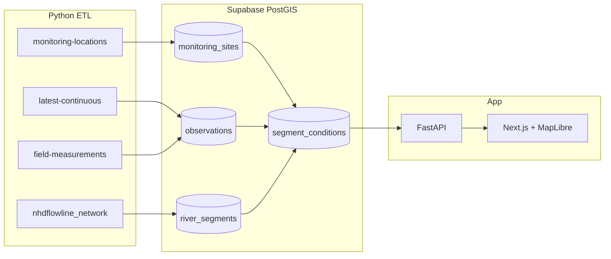
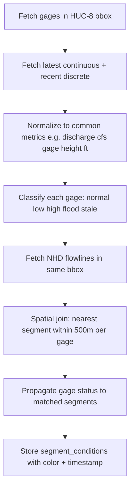

# Rivreance: USGS Water Conditions River Map

## Goal

Create a **traffic-style river map** where NHD river segments are color-coded by current water conditions, sourced from USGS **continuous** (sensor) and **discrete** (field measurement) data. Scope the MVP to **one HUC-8 watershed** so you can learn data-pipelining, APIs, geospatial joins, and full-stack delivery without national-scale complexity.

## Recommended Stack (Balanced Full-Stack)


| Layer             | Choice                                                      | Why                                                                                                   |
| ----------------- | ----------------------------------------------------------- | ----------------------------------------------------------------------------------------------------- |
| **Data pipeline** | Python 3.12+                                                | Your strength; best ecosystem for ETL, geospatial, and future ML                                      |
| **HTTP / API**    | FastAPI                                                     | Modern Python API skills; serves map tiles/GeoJSON and health checks                                  |
| **Frontend**      | Next.js + TypeScript + MapLibre GL JS                       | Meaningful JS learning; MapLibre supports MVT tiles from USGS Fabric                                  |
| **Database**      | Supabase (Postgres + PostGIS)                               | Already planned; great for geo queries, cron, and future Realtime                                     |
| **Orchestration** | Python script + Supabase `pg_cron` (or GitHub Actions cron) | Simple MVP scheduling; upgrade to Airflow/Prefect later if desired                                    |
| **USGS client**   | Direct OGC API calls via `httpx`                            | Use the **modern** API at `api.waterdata.usgs.gov/ogcapi/v0/` (legacy WaterServices retires ~Q1 2027) |


> **Note:** Your existing `[USGS_API_KEY](.env)` works with the new OGC API. Keep it server-side only (Python ETL / FastAPI), never in the browser.

---

## Core Data Sources




### USGS Water Data OGC API (values at gages)

- `[/collections/monitoring-locations](https://api.waterdata.usgs.gov/ogcapi/v0/collections/monitoring-locations)` — gage coordinates, names, flood stages
- `[/collections/latest-continuous](https://api.waterdata.usgs.gov/ogcapi/v0/collections/latest-continuous)` — most recent sensor readings (streamflow, gage height, etc.)
- `[/collections/field-measurements](https://api.waterdata.usgs.gov/ogcapi/v0/collections/field-measurements)` — discrete samples
- `[/collections/time-series-metadata](https://api.waterdata.usgs.gov/ogcapi/v0/collections/time-series-metadata)` — discover which parameters each site reports

**Ingestion pattern (per USGS docs):** query `monitoring-locations` filtered by your basin bbox or HUC, then use returned site IDs to query continuous/discrete endpoints. The `daily` endpoint supports `bbox`; others require the two-step site-ID approach.

### USGS National Hydrologic Geospatial Fabric (river geometry)

- `[nhdflowline_network](https://api.water.usgs.gov/fabric/pygeoapi/collections/nhdflowline_network)` — river segment LineStrings (the "roads" you will color)
- **MVT tiles** from the same Fabric service for performant base map rendering in MapLibre
- Optional later: [NLDI](https://waterdata.usgs.gov/blog/nhd-viz-demo/) for upstream/downstream routing between gages and segments

---

## The Hard Problem: Gage Points → Colored River Segments

USGS data lives at **points** (gages). Traffic-style maps need **line segments**. MVP strategy for a single basin:




**MVP simplifications (intentional learning tradeoffs):**

- Color segments **near** gages first (spatial join), not full hydrologic routing
- Use **one primary parameter** for coloring (streamflow `parameter_code=00060` or gage height `00065`)
- Classify with **percentile bins** computed from 30-day history at each site, supplemented by official flood stage metadata when available
- Mark segments with no nearby gage or stale data (>2h) as **gray**

**Phase 2 enhancement:** use NLDI/Fabric `comid` linkage to propagate conditions upstream/downstream between gages.

---

## Condition Classification (Traffic Analogy)


| Color  | Meaning                 | MVP Rule                                     |
| ------ | ----------------------- | -------------------------------------------- |
| Green  | Normal                  | Between 25th–75th percentile (30-day)        |
| Yellow | Elevated / below normal | 75th–90th or 10th–25th percentile            |
| Red    | Extreme                 | Above 90th, below 10th, or above flood stage |
| Gray   | Unknown / stale         | No reading or older than threshold           |


Store the raw value, percentile, and classification reason in Supabase so the UI can show tooltips and you can tune thresholds without re-ingesting.

---

## Supabase Schema (MVP)

Enable **PostGIS** extension. Key tables:

- `**basins**` — your chosen HUC-8 id, name, bbox geometry
- `**monitoring_sites**` — USGS site id, name, `geom` (Point), flood stage metadata
- `**observations**` — unified table for continuous + discrete: `site_id`, `parameter_code`, `value`, `unit`, `observed_at`, `source` (`continuous` | `field`)
- `**river_segments**` — NHD `comid`, `geom` (LineString), stream order, cached from Fabric
- `**segment_conditions**` — `segment_id`, `status`, `color`, `source_site_id`, `computed_at` (materialized view or table refreshed by ETL)
- `**ingestion_runs**` — audit log for pipeline debugging

**RLS:** public `SELECT` on read tables for MVP; writes only via service role from Python ETL. Enable RLS on all public tables per Supabase best practices.

**Indexes:** GiST on all `geom` columns; btree on `(site_id, observed_at DESC)`.

---

## Repository Layout

Greenfield project at `[C:\Users\musia\OneDrive\Desktop\Projects\Rivreance](C:\Users\musia\OneDrive\Desktop\Projects\Rivreance)`:

```
rivreance/
├── backend/
│   ├── pyproject.toml          # httpx, fastapi, geopandas, shapely, pydantic
│   ├── etl/
│   │   ├── ingest_sites.py
│   │   ├── ingest_observations.py
│   │   ├── ingest_flowlines.py
│   │   └── compute_segment_conditions.py
│   ├── api/
│   │   └── main.py             # FastAPI: /health, /basin, /segments GeoJSON
│   └── lib/
│       ├── usgs_client.py      # OGC API wrapper with pagination + rate limiting
│       └── classify.py         # percentile + flood-stage logic
├── frontend/
│   ├── package.json            # next, maplibre-gl, @supabase/supabase-js
│   ├── app/                    # Next.js App Router
│   └── components/
│       ├── RiverMap.tsx
│       ├── Legend.tsx
│       └── SitePopup.tsx
├── supabase/
│   ├── config.toml
│   └── migrations/
│       └── 001_init_postgis.sql
├── .env.example
└── README.md
```

---

## Implementation Phases

### Phase 0 — Discovery (1–2 days)

- Pick your HUC-8 basin (e.g., via [USGS Watershed Boundary Dataset](https://www.usgs.gov/national-hydrography/watershed-boundary-dataset))
- Write a Jupyter notebook or small script to hit OGC API endpoints and inspect GeoJSON responses
- Confirm which gages in the basin report streamflow/gage height
- Prototype a Fabric `nhdflowline_network` bbox query and visualize in QGIS or a quick Folium map

### Phase 1 — Python ETL Pipeline (core learning)

- Build `[usgs_client.py](backend/lib/usgs_client.py)`: paginated fetch, retry, bbox/site-id filters
- Ingest sites → `monitoring_sites`
- Ingest `latest-continuous` + recent `field-measurements` → `observations`
- Ingest flowlines for basin bbox → `river_segments` (one-time or weekly refresh)
- Compute `segment_conditions` via spatial join (GeoPandas or raw PostGIS `ST_DWithin`)
- Log every run to `ingestion_runs`
- Schedule every 15–30 minutes via cron

**Python skills gained:** async HTTP, pagination, GeoPandas spatial joins, idempotent upserts, error handling, structured logging

### Phase 2 — Supabase + PostGIS

- `supabase init` + migration for schema above
- Seed `basins` with your HUC-8
- Create a GeoJSON-export view or RPC: `get_basin_segment_conditions(basin_id)`
- Optional: Supabase Realtime on `segment_conditions` for live map updates

### Phase 3 — FastAPI Layer

- Thin API in front of Supabase (or direct Supabase client from frontend for reads)
- Endpoints:
  - `GET /api/v1/basins/{id}/segments` — GeoJSON FeatureCollection with color properties
  - `GET /api/v1/basins/{id}/sites` — gage points with latest readings
  - `GET /api/v1/health` — last ingestion timestamp
- Use Supabase service role key only in backend

### Phase 4 — Map UI (TypeScript learning)

- Next.js app with MapLibre GL JS
- Base layer: Fabric MVT tiles for river network
- Overlay: colored segments from your API (GeoJSON source or vector tiles you generate)
- Gage markers with popups (continuous vs discrete badge)
- Legend, parameter filter, "last updated" timestamp
- Responsive layout for mobile

**JS skills gained:** React components, async data fetching, map layer styling (`line-color` data-driven expressions), TypeScript types for GeoJSON

### Phase 5 — MVP Polish

- Handle stale data gracefully (gray segments, warning banner)
- Add discrete sample points as a toggleable layer
- Basic error states when ETL fails
- Deploy: Vercel (frontend) + Supabase (DB) + Railway/Render cron (ETL) or GitHub Actions scheduled workflow

---

## Future State: MCP Integration

Build a **Rivreance MCP server** (Python, using the MCP SDK) that exposes tools Cursor/agents can call:


| Tool                     | Purpose                                                     |
| ------------------------ | ----------------------------------------------------------- |
| `get_basin_conditions`   | Current segment status summary for a basin                  |
| `get_site_history`       | Time series for a gage                                      |
| `find_sites_near`        | Sites within radius of lat/lon                              |
| `explain_segment_status` | Why a segment is red (percentile, flood stage, source gage) |


This reuses your FastAPI/Supabase layer — the MCP server is a thin adapter, not a second data path.

---

## Future State: ML Predictions

After 30+ days of stored observations:

1. **Per-gage forecasting** — Prophet or sklearn time-series on continuous streamflow/gage height
2. **Write predictions** to `observations` with `source = 'predicted'` or a dedicated `predictions` table
3. **Extend `compute_segment_conditions`** to use predicted values for a "forecast" map mode (e.g., +6h, +24h)
4. **Evaluate** with holdout MAE/RMSE; surface confidence in UI (dashed lines, opacity)

Start with one gage, one parameter, one horizon before scaling.

---

## Key Risks and Mitigations


| Risk                                                                    | Mitigation                                                 |
| ----------------------------------------------------------------------- | ---------------------------------------------------------- |
| Legacy API docs/tutorials                                               | Use only `api.waterdata.usgs.gov/ogcapi/v0/`               |
| Segment coloring without hydrologic routing looks "wrong" between gages | Accept for MVP; document limitation; add NLDI in Phase 2   |
| National Fabric queries are huge                                        | Scope to single HUC-8 bbox; cache flowlines locally        |
| Rate limits / large responses                                           | Paginate, cache metadata, ingest incrementally             |
| Discrete data is sparse vs continuous                                   | Show both layers; don't require discrete for segment color |


---

## Suggested First Basin

Choose a HUC-8 you care about with **5+ active streamgages** reporting discharge. Verify via a quick `monitoring-locations` bbox query before committing. Document the choice in `README.md`.

---

## Success Criteria for MVP

- [ ] ETL runs on schedule and populates Supabase without manual steps
- [ ] Map shows NHD river segments color-coded by condition in one basin
- [ ] Gage popups show continuous and discrete readings where available
- [ ] Legend explains colors; "last updated" is visible
- [ ] Code is split cleanly: Python owns data, TypeScript owns presentation
- [ ] `.env.example` documents all required keys (no secrets committed)